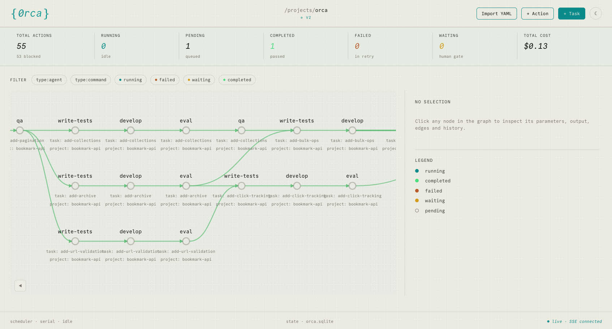

# orca (wip)

Declarative build orchestrator for long-running, autonomous Claude Code agent builds.



Define tasks in YAML. Orca expands them into an action graph, walks the graph through Claude Code agents and shell commands, and routes outcomes along conditional edges — retrying on failure, escalating to supervisors, and tracking cost and iteration budgets.

```yaml
name: bookmark-api
model: sonnet
scope:
  writable: ["src/**", "test/**"]

templates:
  tdd:
    actions: [write-tests, develop, eval]
    types:
      write-tests:
        type: agent
        max_turns: 40
      develop:
        type: agent
        max_turns: 80
      eval:
        type: command
        command: "bun test"
        edges: { fail: develop }

tasks:
  - id: setup-schema
    template: tdd
    prompt: >
      Create src/db.ts with SQLite tables for bookmarks,
      tags, and bookmark_tags. Make all tests pass.

  - id: impl-bookmarks
    template: tdd
    depends_on: [setup-schema]
    prompt: >
      Create src/bookmarks.ts with CRUD functions.
      Make all tests pass.

  - id: impl-tags
    template: tdd
    depends_on: [setup-schema]
    prompt: >
      Create src/tags.ts with tag management functions.
      Make all tests pass.

  - id: api-bookmarks
    template: tdd
    depends_on: [impl-bookmarks, impl-tags]
    prompt: >
      Add bookmark REST endpoints to src/server.ts.
      Make all tests pass.
```

## Key Concepts

- **Actions** — individual units of work (`agent`, `agent-api`, `command`)
- **Edges** — conditional transitions between actions (`pass`, `fail`, `timeout`, `stuck`, `error`, `max_turns`, `cost_exceeded`)
- **Templates** — reusable action chain definitions (e.g. `tdd`: write-tests → develop → eval)
- **Supervisors** — meta-agents that diagnose failures and edit the graph at runtime
- **Projects** — organizational scope with model, nix, git, and file scope config
- **Graph semantics** — diamond dependencies wait for all predecessors before activating
- **Stuck detection** — identical outputs across iterations trigger escalation
